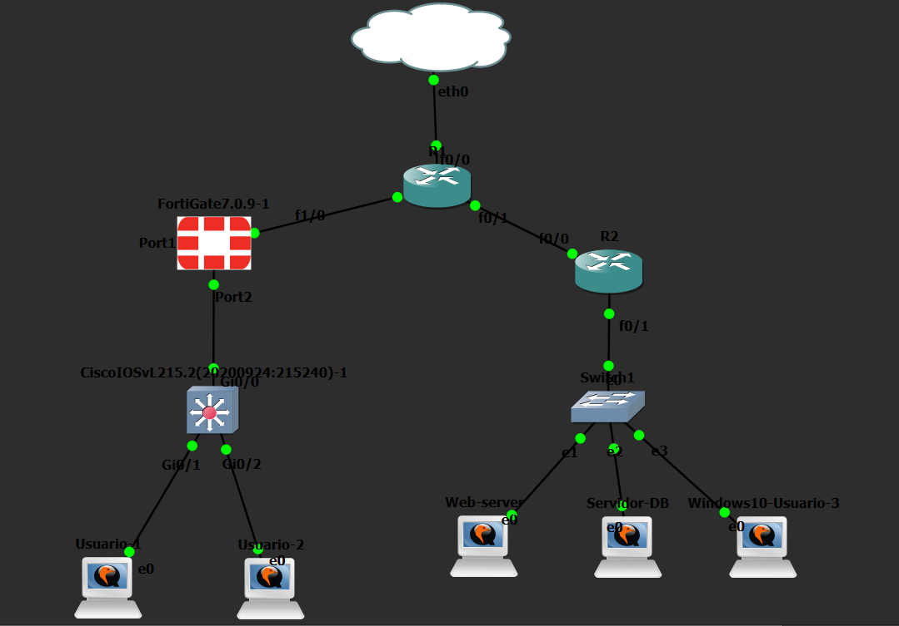

# Parcial 1 — FortiGate + Cisco VPN Site-to-Site en GNS3

> 🎥 **Video de demostración (YouTube):** https://www.youtube.com/watch?v=AmfxQ1WURpc

Laboratorio de redes y seguridad implementado en **GNS3** con **FortiGate 7.0.9**, equipos Cisco IOS, clientes Windows y servidores Ubuntu. El proyecto incluye VLANs, DHCP, salida real a Internet mediante NAT, filtrado web, políticas de firewall, una VPN IPsec Site-to-Site entre FortiGate y Cisco, servidor web y servidor MariaDB.

---

## Topología



También se incluye un diagrama adicional en:

- [Diagrama de topología](Topologia/Diagrama.png)

---

## Propósito

El objetivo del laboratorio es implementar una infraestructura segmentada y segura que permita:

- Separar usuarios y administradores mediante VLANs.
- Entregar direccionamiento dinámico a la VLAN de usuarios.
- Proporcionar salida real a Internet.
- Aplicar políticas de firewall y filtrado web desde la GUI del FortiGate.
- Crear una VPN IPsec Site-to-Site entre el FortiGate y un router Cisco.
- Permitir acceso al Web Server únicamente por HTTP desde la VLAN 10.
- Bloquear servicios no autorizados y registrar los intentos.
- Mantener un Web Server HTTP y un DB Server con MariaDB escuchando en TCP/3306.

---

## Direccionamiento principal

| Equipo / Red | Interfaz | Dirección |
|---|---|---|
| FortiGate WAN | port1 | 198.51.100.2/30 |
| ISP hacia FortiGate | FastEthernet1/0 | 198.51.100.1/30 |
| ISP hacia R-SUCURSAL | FastEthernet0/1 | 203.0.113.1/30 |
| R-SUCURSAL WAN | FastEthernet0/0 | 203.0.113.2/30 |
| VLAN 10 — USUARIOS | VLAN10-USUARIOS | 10.21.40.1/25 |
| PC Usuario VLAN 10 | Ethernet | 10.21.40.10/25 |
| VLAN 20 — ADMIN | VLAN20-ADMIN | 10.21.41.1/25 |
| PC Administrador | Ethernet | 10.21.41.10/25 |
| Red de servidores | — | 10.21.40.128/28 |
| R-SUCURSAL LAN | FastEthernet0/1 | 10.21.40.129/28 |
| WEB-SRV | ens3 | 10.21.40.130/28 |
| DB-SRV | ens3 | 10.21.40.131/28 |

El plan completo se encuentra en:

- [Direccionamiento/Direccionamiento.txt](Direccionamiento/Direccionamiento.txt)

---

## Implementación

### VLANs y trunk 802.1Q

El switch de la sede utiliza:

- **VLAN 10 — USUARIOS**
- **VLAN 20 — ADMIN**
- **VLAN 999 — NATIVE**
- **Gi0/0** como trunk 802.1Q.
- VLANs permitidas en el trunk: **10,20,999**.
- **Gi0/1** como puerto de acceso para VLAN 10.
- **Gi0/2** como puerto de acceso para VLAN 20.

La VLAN 10 utiliza DHCP desde el FortiGate con el rango:

```text
10.21.40.10 - 10.21.40.100
Gateway: 10.21.40.1
DNS: 8.8.8.8 / 1.1.1.1
```

---

### Salida a Internet

El FortiGate utiliza una ruta por defecto hacia:

```text
0.0.0.0/0
Gateway: 198.51.100.1
Interface: port1
```

Las políticas de Internet de VLAN 10 y VLAN 20 utilizan **NAT habilitado**.

La salida fue validada desde VLAN 10 mediante:

```text
ping 8.8.8.8
tracert 8.8.8.8
```

---

### Web Filter

Se creó el perfil:

```text
WF-BLOQUEO-INVENTARIO
```

Regla estática:

```text
URL: 10.21.40.130/inventario*
Type: Wildcard
Action: Block
Status: Enable
```

La página principal del servidor permanece disponible:

```text
http://10.21.40.130
```

Mientras que la sección:

```text
http://10.21.40.130/inventario/
```

es bloqueada por el FortiGate mediante el perfil Web Filter.

---

### VPN Site-to-Site FortiGate ↔ Cisco

Se configuró el túnel:

```text
VPN-R-SUCURSAL
```

#### Phase 1

| Parámetro | Valor |
|---|---|
| IKE | IKEv1 |
| Peer remoto | 203.0.113.2 |
| Interfaz | port1 |
| Autenticación | Pre-shared Key |
| Modo | Main (ID protection) |
| Cifrado | DES |
| Hash | SHA1 |
| Diffie-Hellman | Group 5 |
| Lifetime | 86400 s |

> La clave precompartida no se publica en este repositorio.

#### Phase 2

| Parámetro | Valor |
|---|---|
| Red local | 10.21.40.0/25 |
| Red remota | 10.21.40.128/28 |
| Cifrado | DES |
| Autenticación | SHA1 |
| PFS | Enabled |
| DH Group | 5 |
| Puertos | All |
| Protocolo | All |

El túnel fue validado en Cisco mediante:

```text
show crypto isakmp sa
show crypto ipsec sa
```

Se verificó el estado **QM_IDLE / ACTIVE**, SAs ESP activas y tráfico IPsec en ambos sentidos.

También se comprobó que la comunicación con el Web Server funciona únicamente mientras la VPN está activa.

---

### Política HTTP hacia el Web Server

Desde VLAN 10 se permite exclusivamente HTTP hacia el Web Server:

```text
VLAN10-WEB-HTTP
Source: VLAN10-USUARIOS address
Destination: WEB-SERVER
Service: HTTP
Action: ACCEPT
NAT: Disabled
Web Filter: WF-BLOQUEO-INVENTARIO
```

El resto del tráfico hacia el mismo servidor se bloquea:

```text
VLAN10-DENY-WEB-OTHER
Service: ALL
Action: DENY
Logging: Enabled
```

Pruebas realizadas:

```powershell
Test-NetConnection 10.21.40.130 -Port 80
Test-NetConnection 10.21.40.130 -Port 22
```

Resultado esperado:

```text
TCP/80  -> True
TCP/22  -> False
```

El intento SSH queda registrado en **Log & Report → Forward Traffic** como **Deny: policy violation**.

---

## Servidores

### WEB-SRV

```text
Hostname: WEB-SRV
IP: 10.21.40.130/28
Gateway: 10.21.40.129
Servicio: HTTP / TCP 80
```

La página principal identifica el servidor como:

```text
Servidor Web Operativo
PARCIAL 1
WEB-SRV - 10.21.40.130
```

Configuración:

- [WEB-SRV-GitHub.txt](Scripts%20Servidores/WEB-SRV-GitHub.txt)

### DB-SRV

```text
Hostname: DB-SRV
IP: 10.21.40.131/28
Gateway: 10.21.40.129
Servicio: MariaDB / TCP 3306
Bind: 0.0.0.0:3306
```

Se verificó el servicio con:

```bash
sudo ss -lntp | grep 3306
```

Configuración:

- [DB-SRV-GitHub.txt](Scripts%20Servidores/DB-SRV-GitHub.txt)

---

## Evidencias por requisito

### Requisito 1 — Direccionamiento y VLANs

Se verificaron VLAN 10, VLAN 20, VLAN nativa 999, trunk 802.1Q, DHCP para usuarios, direccionamiento /28 de servidores y hostnames.

### Requisito 2 — Salida a Internet

Se comprobó conectividad real mediante `ping 8.8.8.8` y `tracert 8.8.8.8`.

### Requisito 3 — Página de violación

El FortiGate bloquea `/inventario/` mediante `WF-BLOQUEO-INVENTARIO` y muestra la página **Access Blocked**.

### Requisito 4 — VPN FortiGate ↔ Cisco

Se demostró:

- Túnel IPsec activo.
- Estado `QM_IDLE / ACTIVE`.
- SAs ESP activas.
- `tracert` al Web Server.
- Pérdida de comunicación al bajar la VPN.
- Recuperación de comunicación al volver a subirla.

### Requisito 5 — Servidores

- Web Server HTTP operativo en `10.21.40.130:80`.
- DB Server con MariaDB escuchando en `0.0.0.0:3306`.

### Requisito 6 — Repositorio GitHub

Este repositorio contiene direccionamiento, topología, archivos de configuración, documentación del FortiGate y evidencias.

### Requisito 7 — Usuarios → Web por HTTP

Se comprobó que TCP/80 está permitido y TCP/22 está denegado y registrado.

### Requisito 8 — Credenciales y banner del switch

El switch incluye usuario local con contraseña cifrada, banner MOTD **PARCIAL 1**, autenticación local y búsqueda DNS deshabilitada.

📄 Documento consolidado:

- [Evidencias/Evidencias.pdf](Evidencias/Evidencias.pdf)

---

## Configuraciones

### Equipos de red

- [Switch de sede](Show%20running-config/Show%20runnin-config%20Switch%20sede%201.txt)
- [ISP-R1](Show%20running-config/Show%20running-config%20ISP.txt)
- [R-SUCURSAL](Show%20running-config/Show%20running-config%20R-Sucursal.txt)
- [FortiGate](Show%20running-config/Show%20running-config%20Fortigate.txt)

### Configuración documentada del FortiGate vía GUI

- [Configuracion-FortiGate.pdf](Configuracion%20Fortigate/Configuracion-FortiGate.pdf)

---

## Estructura del repositorio

```text
parcial-1-fortigate-cisco-vpn/
├── README.md
├── Configuracion Fortigate/
│   └── Configuracion-FortiGate.pdf
├── Direccionamiento/
│   └── Direccionamiento.txt
├── Evidencias/
│   └── Evidencias.pdf
├── Scripts Servidores/
│   ├── DB-SRV-GitHub.txt
│   └── WEB-SRV-GitHub.txt
├── Show running-config/
│   ├── Show runnin-config Switch sede 1.txt
│   ├── Show running-config Fortigate.txt
│   ├── Show running-config ISP.txt
│   └── Show running-config R-Sucursal.txt
└── Topologia/
    ├── Diagrama.png
    └── Topologia.png
```

---

## Tecnologías utilizadas

- GNS3
- FortiGate VM / FortiOS 7.0.9
- Cisco IOS
- Windows 10
- Ubuntu Server
- Nginx
- MariaDB
- IPsec / IKEv1
- IEEE 802.1Q
- DHCP
- NAT
- Web Filter
- GitHub

---

## Nota de seguridad

Los algoritmos DES y SHA1 se utilizaron por compatibilidad con los appliances disponibles en el laboratorio. Para entornos de producción se recomienda utilizar suites criptográficas modernas.

---

## Autor

Repositorio desarrollado para el **Parcial 1 de redes y seguridad**.

GitHub: **Carlos-2140**
